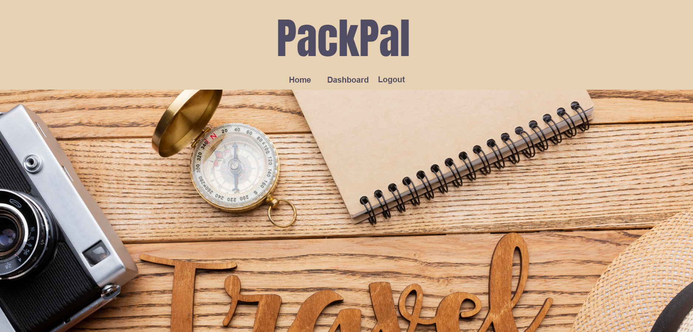
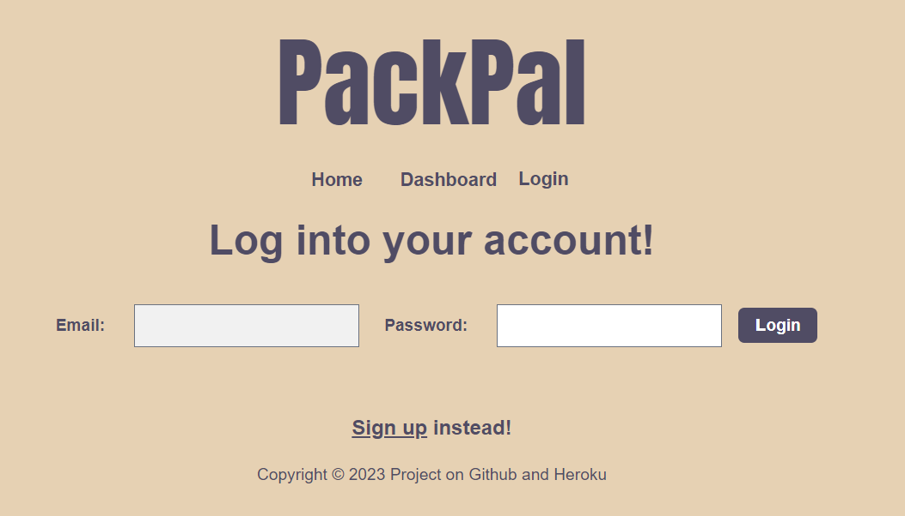
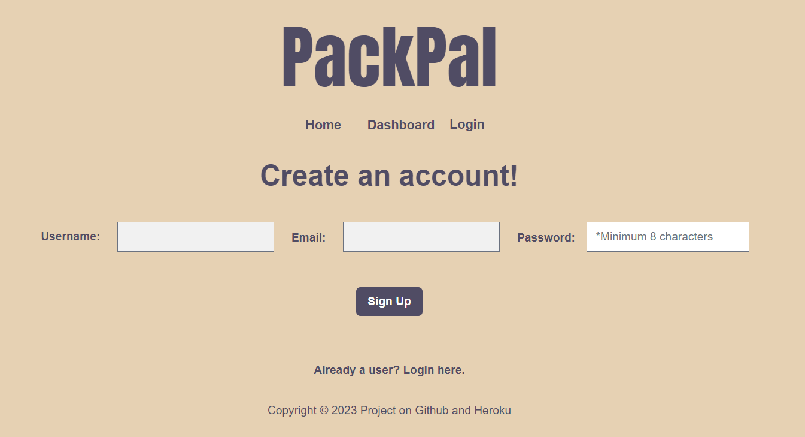
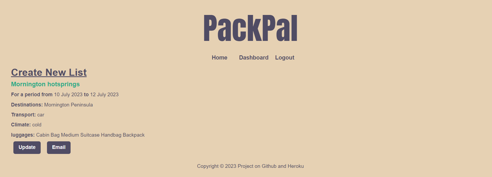

# Travel-packing-app

## Description
    
PackPal in an application designed to help travellers with organising their luggage and the items they will need to bring to their trips - whether it's for a short road trip, a holiday overseas or business travels.

    
## Table of Contents
    
- [Installation](#installation)
- [Usage](#usage)
- [Credits](#credits)
- [Contacts](#contacts)
- [License](#license)
- [How to Contribute](#how-to-contribute)
- [Tests](#tests)
    
## Installation
    
Open the [PackPal App](https://travel-packing-app-0c97b9ac0fdb.herokuapp.com/) on a browser such as Google Chrome, Firefox or Edge etc.

## Usage

Once you have landed on the homepage, as visualised above, you may first click on the "Login" link on the top right of the navigation panel. This will lead you to the login page, wherein you will enter your credentials to access your personalised dashboard.

If you haven't got an account, you may choose to sign up instead by clicking on the sign-up link at the bottom.

Once at the sign-up page, you may enter your chosen credentials to create an account, this will automatically log you in. With this acount, you may access your personalised dashboard where all your created packing lists will be kept. The dashboard may be accessed by clicking the dashboard link in the middle of the navigation panel.

Here, you will be able to see all the packing lists, and their journey summaries, you have created. You may click on the "create new list" link to create a brand-new list. You may also click on the title of your already-created list to both add items to that list, as well as see the items you have already added.

On this page, accessed by clicking "Create New List" on the dashboard page, you will be able to create a new packing list by typing a list title on the "name" field, and clicking the "create list" button. Optionally, you may choose to fill out the rest of the form with information such as the dates of your trip, the destination, what you will travel by, what kind of baggage you will be bringing, as well as the climate of your destination.

On this page, accessed by clicking the title of your created list, you will be able to add all the items you may need to bring to your trip. You can do this by typing in the item you would like to bring in the field labelled "Enter items" (an automatic drop-down menu will appear to help you with your list creation) and then clicking the "Add" button. You may also choose to add on suggested packing items to your list by simply clicking on them. The list itself will appear at the bottom of the page, and you may sort your list by name, category, and bags - all in either ascending or descending order.

And there you have it! A simple and easy-to-use app for all your travel-packing-list needs!

## Credits

<a href="https://www.freepik.com/icon/suitcase_2744091#fromView=search&term=luggage+tick&page=1&position=11&track=ais&uuid=048cc75c-22f1-46a2-896b-2fbcbbf01d01">Icon by Smashicons</a>

## Contacts

Project Contributers:
- [amethyslyre](https://github.com/amethystlyre)
- [AlexGerraty](https://github.com/AlexGerraty)
- [RubabaKhandaker](https://github.com/RubabaKhandaker)

## License

 
This project is licensed under the MIT License - see the [LICENSE.md](license) file for details    
 
## How to Contribute
    
Feel free to contribute your ideas or bug fixes for this project by raising a new issue or new pull request.
    
## Tests
NA